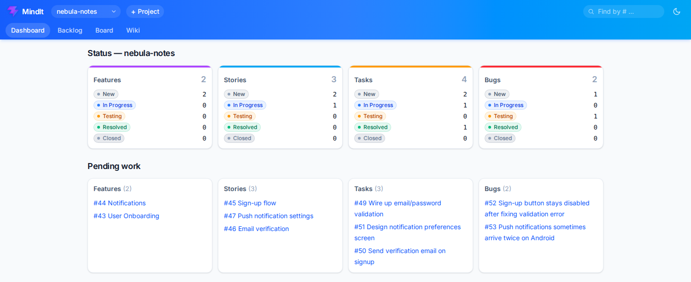
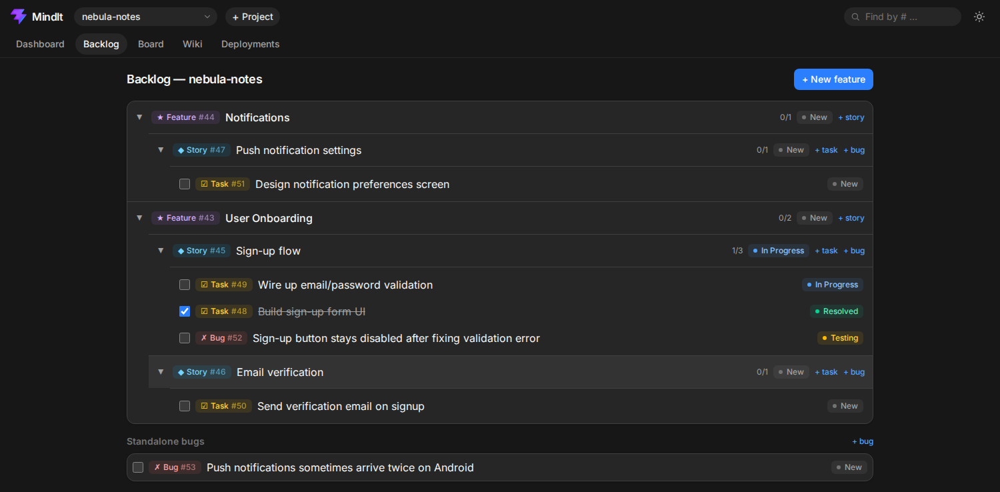
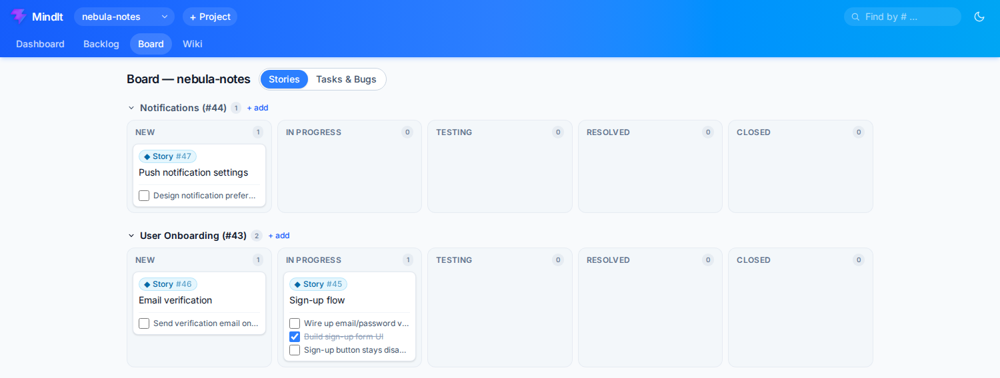
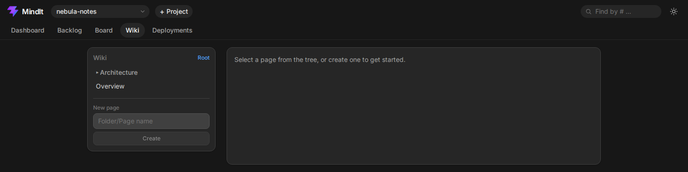
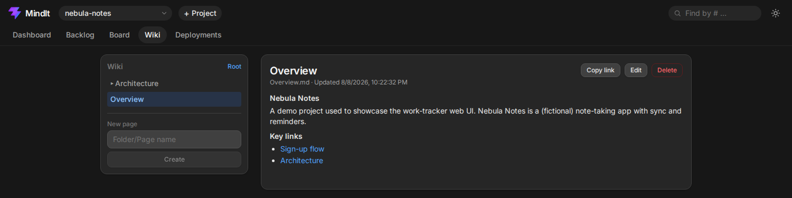

<p align="center">
  
</p>

<h1 align="center">MindIt</h1>

<p align="center">
  A lightweight ADO-style work tracker (Feature → Story → Task/Bug) usable two ways —<br>
  entirely through natural language via a Claude Code MCP server, and through a real<br>
  drag-and-drop web UI. Plain markdown files with YAML frontmatter are the single source<br>
  of truth for both — no database, no cache, every file safe to hand-edit directly.
</p>

<p align="center">
  <a href="#getting-started"><b>Getting started</b></a> ·
  <a href="#data-model"><b>Data model</b></a> ·
  <a href="#wiki"><b>Wiki</b></a> ·
  <a href="#tools-31"><b>Tools</b></a> ·
  <a href="#skills"><b>Skills</b></a>
</p>

## Screenshots

<table>
<tr>
<td><br><sub>Dashboard — status counts + pending work</sub></td>
<td><br><sub>Backlog — expandable Feature → Story → Task/Bug tree</sub></td>
</tr>
<tr>
<td><br><sub>Board — drag-and-drop Kanban, swimlaned by Feature</sub></td>
<td><br><sub>Wiki — folder/page tree</sub></td>
</tr>
<tr>
<td><br><sub>Wiki page — markdown body with in-app links</sub></td>
</tr>
</table>

## Getting started

### Web UI

```
cd web && npm install --prefix server && npm install --prefix client && npm install
npm run dev
```

Opens the API on `http://localhost:4001` and the app on `http://localhost:5173` (Vite
proxies `/api` to the Express server). Local-only, no auth — same trust model as the MCP
server.

- `web/server` — a small Express API (TypeScript, run via `tsx`) that imports the store
  functions in `src/store/*.ts` directly, rather than going through the MCP protocol.
  Every item's globally unique numeric id makes `GET/PATCH/DELETE /api/items/:id` work
  regardless of type or project, mirroring `get_item`.
- `web/client` — React + Vite + TypeScript + Tailwind, with five views: **Dashboard**
  (status counts + pending work, like `get_status`/`get_resume`), **Backlog** (an
  expandable Feature → Story → Task/Bug tree, the primary place to create items),
  **Board** (a real drag-and-drop Kanban — Stories swimlaned by Feature, or a
  Tasks/Bugs board scoped to one Story — dragging a card between columns updates its
  status), **Item detail** (full read/edit/delete view, reachable by clicking a
  card or typing a bare number into the search box), and **Wiki** (`/wiki/<project>/<path>`
  — a folder/page tree with the same write/preview markdown editor used for Notes and
  Comments, plus a "Copy link" button for pasting a page into a comment elsewhere).

`web/` reads and writes the exact same `data/` files as the MCP server — a work item
created via `/add-to-work` shows up on the board on refresh, and a card dragged on the
board shows up in `/resume` next session. No second source of truth.

### MCP server (Claude Code)

Registered as a user-scope Claude Code MCP server, so it's available from any project
directory:

```
claude mcp add --scope user work-tracker -- npx tsx /home/rayan/projects/DaybreakOxford/agent-planner/src/server.ts
```

Run standalone for debugging: `npm start` (hangs waiting on stdio — that's expected; a real
MCP client keeps stdin open).

## Data model

```
Feature
  └─ Story (required parent: a Feature)
       ├─ Task (required parent: a Story)
       └─ Bug  (optional parent: a Story — can stand alone)

Story ←→ Story   (symmetric "related to" link, no direction)
```

Statuses (same five across all four item types): `new`, `in_progress`, `testing`,
`resolved`, `closed`.

## IDs

Every feature/story/task/bug gets a plain sequential number (`1`, `2`, `3`, …) from a single
counter shared across **all** projects and item types (`data/.counter`) — the same way ADO
work item IDs work. A number always identifies exactly one thing, so you can find, update, or
link anything by number alone without saying what type it is or which project it's in
(`get_item`, below). Lookups accept a bare number, a `#`-prefixed number, or a zero-padded
number interchangeably (`3`, `#3`, `00003` all match id `3`); a title substring still works
too as a fallback.

## File layout

```
data/<project-slug>/
  features/<zero-padded-id>.md
  stories/<zero-padded-id>.md
  tasks/<zero-padded-id>.md
  bugs/<zero-padded-id>.md
  wiki/<...folders>/<page>.md   # nested knowledge base, Obsidian-style
  LOG.md          # append-only session log, newest entry first
data/.counter     # shared id counter, global across all projects/types
```

Each item file is YAML frontmatter (`id`, `type`, `project`, `title`, `status`, `created`,
`updated`, plus `feature`/`story`/`links` where applicable) followed by free-text notes.

## Wiki

A per-project knowledge base, laid out as nested folders and markdown pages
(`data/<project-slug>/wiki/…`), the same way an Obsidian vault works — unlike
features/stories/tasks/bugs, a page is addressed by its **path** (e.g.
`Architecture/Database Design`), not a number, since it's knowledge content rather than a
work item. Each page is YAML frontmatter (`title`, `created`, `updated`) plus a markdown
body. Folders are plain directories that exist only while they contain something.

| Tool | What it does |
|---|---|
| `create_wiki_page` | Create a page at a path (creates parent folders); fails if it already exists |
| `update_wiki_page` | Overwrite a page's full body |
| `append_wiki_page` | Append markdown to a page, creating it if it doesn't exist yet — the everyday "write this down" tool |
| `read_wiki_page` | Read a page's title + body |
| `delete_wiki_page` | Delete a page |
| `list_wiki` | List a folder's contents (one level, or `recursive: true` for the full tree) |

There's no dedicated "linked wiki pages" field on features/stories/tasks/bugs — link to a
page the same way you'd link to anything else: paste a markdown link into a Notes field or
`add_comment`, e.g. `[Database design](/wiki/daybreak-oxford/Architecture/Database%20Design)`.
Every wiki tool's response includes this pasteable link. The web UI's `/wiki` page renders
the same tree with a "Copy link" button, and same-origin links in Notes/Comments (`/wiki/…`,
`/item/…`) navigate in-app instead of opening a new tab.

## Tools (31)

| Verb | Feature | Story | Task | Bug |
|---|---|---|---|---|
| add | `add_feature` | `add_story` | `add_task` | `add_bug` |
| update | `update_feature` | `update_story` | `update_task` | `update_bug` |
| delete | `delete_feature` | `delete_story` | `delete_task` | `delete_bug` |
| list | `list_features` | `list_stories` | `list_tasks` | `list_bugs` |

Plus: `link_stories`, `unlink_stories`, `get_status` (counts by type/status), `log_session`,
`get_resume` (pending items + last session, per-project or cross-project), `get_item` (look
up any item by number alone, regardless of type or project), `add_comment`/`update_comment`/
`delete_comment` (ADO-style comment threads on any item), and the wiki tools — see above.

Deleting a Feature/Story with children attached is blocked with a warning unless `force:
true` is passed; force-delete leaves children pointing at a now-missing parent id (a stale
reference is cosmetic for a personal, hand-editable tool — not auto-resolved).

The id counter is a plain read-increment-write on `data/.counter`, not lock-protected —
fine for single-user use, but two truly simultaneous creates could in theory race. Not a
concern this tool is designed to guard against.

## Skills

- `/add-to-work` — infers project + item type from what you say, calls the matching `add_*` tool.
- `/resume` — calls `get_resume` and narrates pending work + last session.

## Confidentiality

`data/` will contain real notes about client work, so it's gitignored — it never
leaves this machine via git. The filesystem is still the only source of truth (nothing
about the tool's design depends on `data/` being tracked); it just isn't pushed anywhere.
Back it up separately if you want that.
