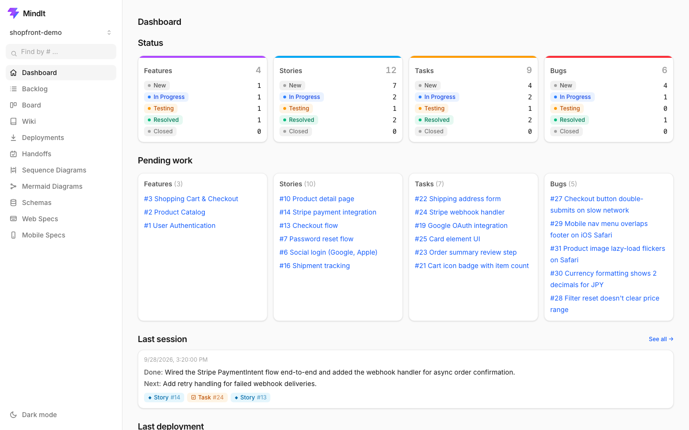
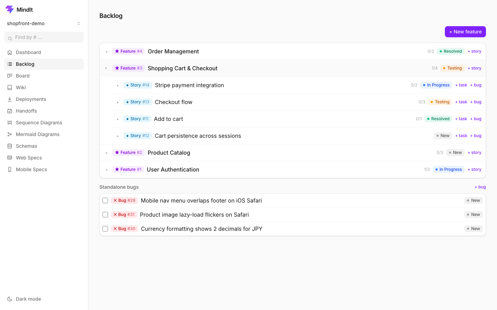
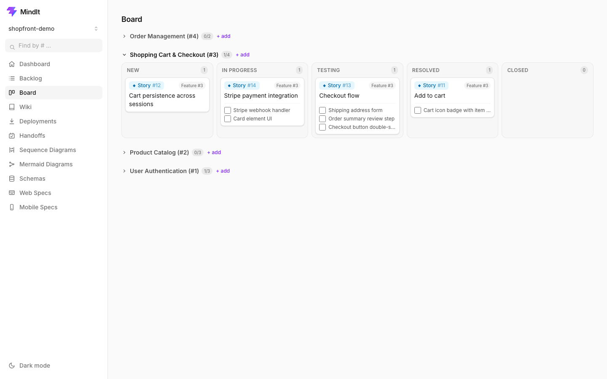
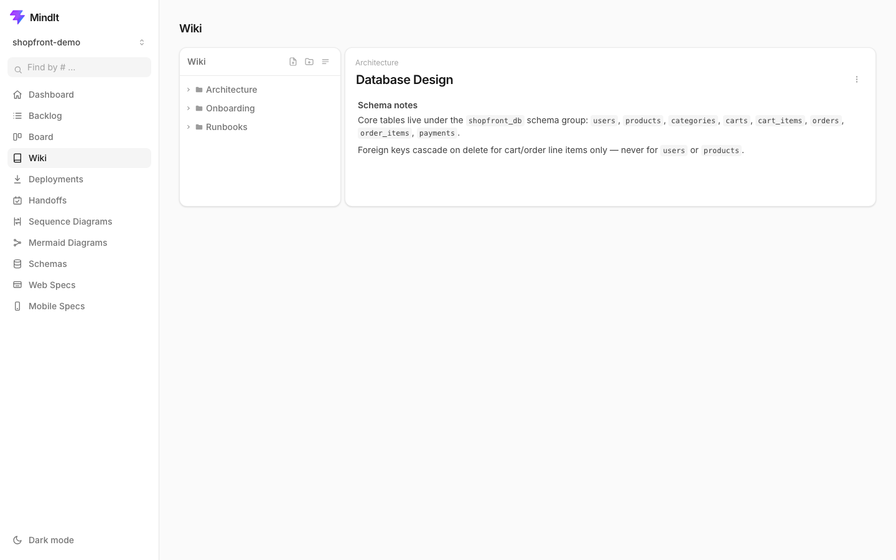
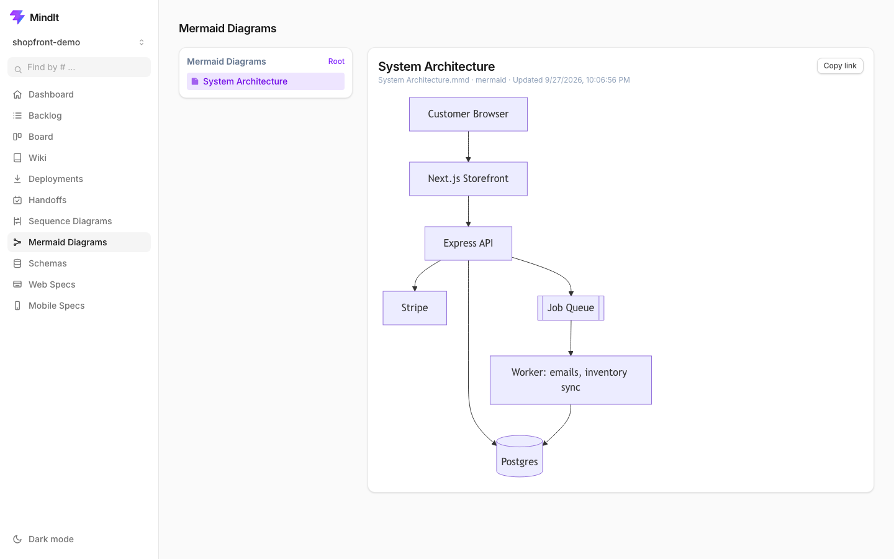
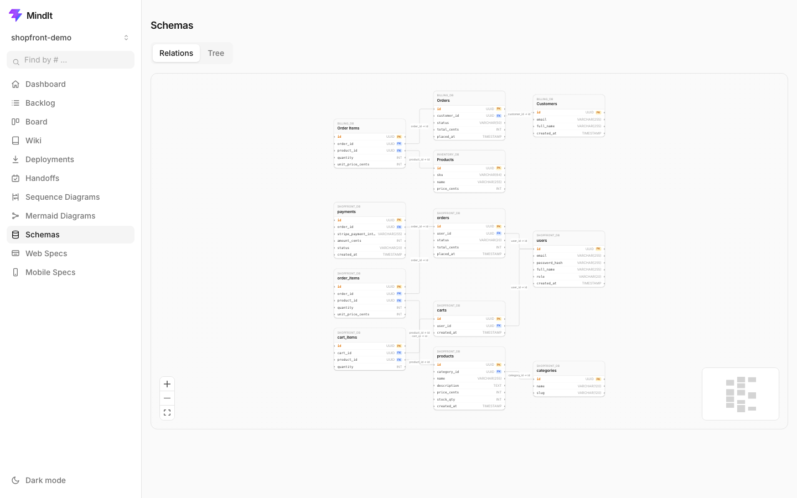
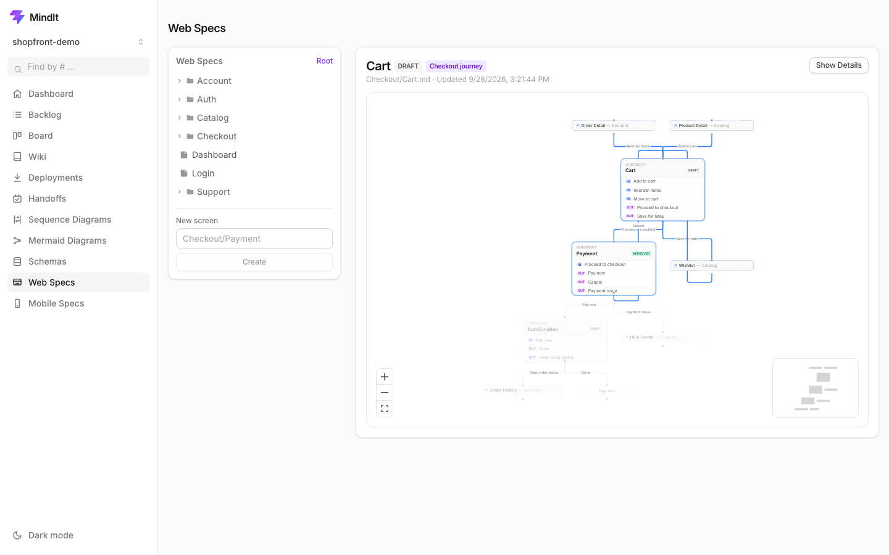
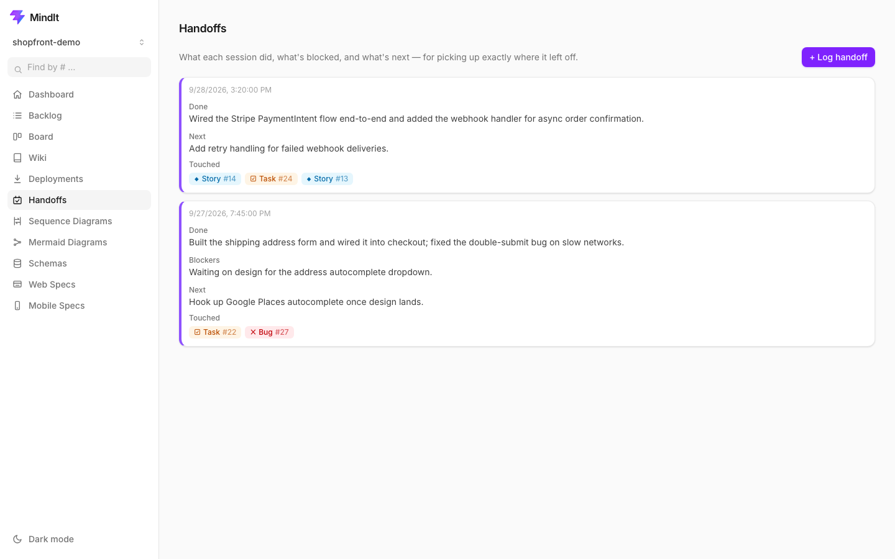
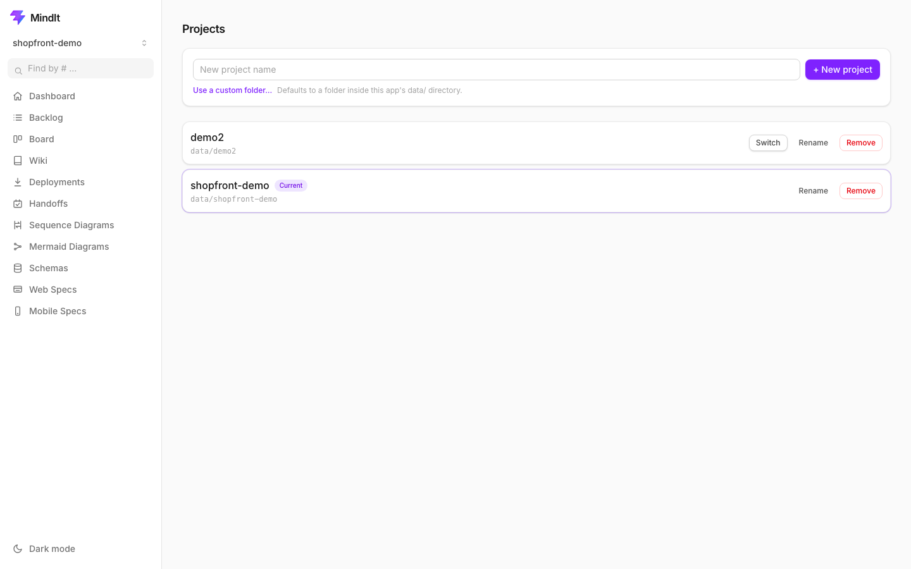

<p align="center">
  
</p>

<h1 align="center">MindIt</h1>

<p align="center">
  A lightweight ADO-style work tracker (Feature → Story → Task/Bug) usable two ways —<br>
  entirely through natural language via a Claude Code MCP server, and through a real<br>
  drag-and-drop web UI. Plain markdown files with YAML frontmatter are the single source<br>
  of truth for both — no database, no cache, every file safe to hand-edit directly.
</p>

<p align="center">
  <a href="#getting-started"><b>Getting started</b></a> ·
  <a href="#data-model"><b>Data model</b></a> ·
  <a href="#projects"><b>Projects</b></a> ·
  <a href="#wiki"><b>Wiki</b></a> ·
  <a href="#deployment-notes"><b>Deployment notes</b></a> ·
  <a href="#handoffs"><b>Handoffs</b></a> ·
  <a href="#diagrams"><b>Diagrams</b></a> ·
  <a href="#database-schemas"><b>Database Schemas</b></a> ·
  <a href="#spec-driven-development"><b>Spec-driven development</b></a> ·
  <a href="#tools-62"><b>Tools</b></a> ·
  <a href="#skills"><b>Skills</b></a>
</p>

## Screenshots

<table>
<tr>
<td><br><sub>Dashboard — status counts, pending work, last session + last deployment</sub></td>
<td><br><sub>Backlog — expandable Feature → Story → Task/Bug tree</sub></td>
</tr>
<tr>
<td><br><sub>Board — drag-and-drop Stories Kanban, swimlaned by Feature, with a Task/Bug checklist per card</sub></td>
<td><br><sub>Wiki — Obsidian-style file explorer with click-to-edit autosave</sub></td>
</tr>
<tr>
<td><br><sub>Diagrams — Mermaid source rendered live, split into Sequence/Mermaid sections</sub></td>
<td><br><sub>Database Schemas — interactive React Flow ER canvas with per-column FK connections</sub></td>
</tr>
<tr>
<td><br><sub>Specs — a journey's screens and transitions, with cross-journey links at the edges</sub></td>
<td><br><sub>Handoffs — session log entries with linked, live-resolved work items</sub></td>
</tr>
<tr>
<td><br><sub>Projects — switch, rename, or register a project at a custom folder</sub></td>
</tr>
</table>

## Getting started

### Web UI

```
cd web && npm install --prefix server && npm install --prefix client && npm install
npm run dev
```

Opens the API on `http://localhost:4001` and the app on `http://localhost:5173` (Vite
proxies `/api` to the Express server). Local-only, no auth — same trust model as the MCP
server.

- `web/server` — a small Express API (TypeScript, run via `tsx`) that imports the store
  functions in `src/store/*.ts` directly, rather than going through the MCP protocol.
  Every item's globally unique numeric id makes `GET/PATCH/DELETE /api/items/:id` work
  regardless of type or project, mirroring `get_item`.
- `web/client` — React + Vite + TypeScript + Tailwind, laid out as a fixed Notion-style
  left sidebar (logo, project switcher, search-by-#, tab navigation, light/dark toggle)
  next to the content pane, instead of a top header. The project switcher is a dropdown
  over every registered project (see [Projects](#projects), below) with an inline
  "New project" form; picking a different project on a path-addressed page (Wiki,
  Diagrams, Schemas, Specs) navigates to that project's URL rather than only updating
  context, so the page you're on stays in sync with the sidebar. Views: **Dashboard**
  (status counts + pending work, like `get_status`/`get_resume`, plus a "Last session"
  card showing the touched-item badges from the latest [Handoffs](#handoffs) entry and a
  "Last deployment" card), **Backlog** (an expandable Feature → Story → Task/Bug tree,
  the primary place to create items — each Feature row shows its `completed/total` Story
  count), **Board** (a real drag-and-drop Kanban — Stories swimlaned by Feature, each
  card tagged with its parent Feature and showing its Tasks/Bugs as a checklist —
  dragging a card between columns updates its status; each Feature's lane shows the same
  `completed/total` count even while collapsed), **Item detail** (full read/edit/delete
  view, reachable by clicking a card or typing a bare number into the search box, with a
  "Linked specs" section for attaching [Spec](#spec-driven-development) screens),
  **Wiki** (`/wiki/<project>/<path>` — an Obsidian-style file explorer: a resizable
  folder-tree sidebar with right-click context menus, inline rename/create, and
  drag-and-drop moves, next to a click-to-edit page body that autosaves instead of an
  explicit Edit/Save flow, plus a "Copy link" button for pasting a page into a comment
  elsewhere), **Diagrams** (`/diagrams/<kind>/<project>/<path>`, split into **Sequence
  Diagrams** and **Mermaid Diagrams** tabs by the diagram's `kind` — the same folder/page
  tree pattern as the Wiki, but each page is Mermaid source rendered live as an SVG, with
  a write/preview editor and its own "Copy link" button), **Schemas**
  (`/schemas/<project>/<path>` — a persistent Relations/Tree toggle: **Relations** is an
  interactive [React Flow](https://reactflow.dev) canvas (`@xyflow/react` + dagre
  auto-layout) of every table and foreign key in the project — draggable/zoomable cards
  with per-column connection handles, hover-to-highlight related tables, and a
  click-to-inspect side panel — while **Tree** is the same folder/table pattern as the
  Wiki, with each leaf a column-by-column form editor instead of raw text), **Specs**
  (`/specs/<platform>/<project>/<path>`, split into **Web Specs**/**Mobile Specs** tabs —
  see [Spec-driven development](#spec-driven-development), below), **Handoffs**
  (`/handoffs` — the project's session log as its own page, with a form to log a new
  entry and each entry showing its touched-item badges; see [below](#handoffs)), and
  **Projects** (`/projects` — see [Projects](#projects), below). On both Backlog and
  Board, a Feature whose Stories are all done drops into a collapsed "Show Completed"
  section so the active work stays in view. A sun/moon toggle in the sidebar switches
  between light and dark — both built on a single restrained neutral-gray palette
  (Tailwind's `neutral` scale, not the bluish `slate`) with a violet accent reserved for
  primary actions/links and color otherwise reserved for status/type badges, closer to
  Notion/Claude/OpenAI than a typical "bright gradient + saturated dark mode" admin UI.

`web/` reads and writes the exact same `data/` files as the MCP server — a work item
created via `/add-to-work` shows up on the board on refresh, and a card dragged on the
board shows up in `/resume` next session. No second source of truth.

### MCP server (Claude Code)

Registered as a user-scope Claude Code MCP server, so it's available from any project
directory:

```
claude mcp add --scope user work-tracker -- npx tsx /home/rayan/projects/MindIt/src/server.ts
```

Run standalone for debugging: `npm start` (hangs waiting on stdio — that's expected; a real
MCP client keeps stdin open).

## Data model

```
Feature
  └─ Story (required parent: a Feature)
       ├─ Task (required parent: a Story)
       └─ Bug  (optional parent: a Story — can stand alone)

Story ←→ Story   (symmetric "related to" link, no direction)
```

Statuses (same five across all four item types): `new`, `in_progress`, `testing`,
`resolved`, `closed`.

A Feature's completion is always *derived*, never stored on the Feature itself: a Story
counts as done once it's `resolved` or `closed`, and a Feature is complete once it has at
least one Story and every Story is done (a Feature with zero Stories is never complete).
`list_features` reports each Feature's `completed/total` Story count and a `[COMPLETE]`
marker; the web UI shows the same count and groups complete Features under "Show
Completed" (see Web UI, above).

The Wiki, Diagrams, Database Schemas, and Spec sections all sit outside this hierarchy
entirely — each is path-addressed content, not a work item, so none of them has a status
or a parent/child link into Feature/Story/Task/Bug. A Spec screen is the one exception with
a link back *into* the hierarchy: `link_spec` stores a one-directional reference on a
feature/story/task/bug (its `specs` field), pointing at the screen it implements.

## IDs

Every feature/story/task/bug gets a plain sequential number (`1`, `2`, `3`, …) from a single
counter shared across **all** projects and item types (`data/.counter`) — the same way ADO
work item IDs work. A number always identifies exactly one thing, so you can find, update, or
link anything by number alone without saying what type it is or which project it's in
(`get_item`, below). Lookups accept a bare number, a `#`-prefixed number, or a zero-padded
number interchangeably (`3`, `#3`, `00003` all match id `3`); a title substring still works
too as a fallback.

## File layout

```
data/<project-slug>/       # or an external folder's .mindit/ subdir — see Projects, below
  features/<zero-padded-id>.md
  stories/<zero-padded-id>.md
  tasks/<zero-padded-id>.md
  bugs/<zero-padded-id>.md
  wiki/<...folders>/<page>.md            # nested knowledge base, Obsidian-style
  deployments/<zero-padded-id>.md        # deployment history
  diagrams/<...folders>/<page>.mmd       # nested Mermaid diagrams, same layout as wiki/
  schemas/<...folders>/<table>.md        # nested SQL table docs, same layout as wiki/
  specs/web/<...folders>/<screen>.md     # nested web screen specs
  specs/mobile/<...folders>/<screen>.md  # nested mobile screen specs
  LOG.md          # append-only session log, newest entry first
data/.counter     # shared id counter, global across all projects/types
data/projects.json  # project registry — slug, display name, external path (or null)
```

Each item file is YAML frontmatter (`id`, `type`, `project`, `title`, `status`, `created`,
`updated`, plus `feature`/`story`/`links`/`specs` where applicable) followed by free-text
notes.

## Projects

MindIt supports more than one project at once, each independent (own id sequence within
the shared counter, own wiki/diagrams/schemas/specs, own session log). A project either
lives at the default `data/<slug>/` location, or points at an external absolute path — in
which case its files live under a hidden `<path>/.mindit/` subdirectory, so a project can
sit inside an existing repo without polluting its root. The registry
(`data/projects.json`) is reconciled against `data/*` on every read, so a folder dropped in
manually (or created before the registry existed) is auto-registered under its folder name.

| Tool/route | What it does |
|---|---|
| `POST /api/projects` | Create a project — `name` required, optional `path` for an external location |
| `GET /api/projects` | List all registered projects (slug, display name, path, created) |
| `PATCH /api/projects/:slug` | Rename a project (display name only — the slug/files don't move) |
| `DELETE /api/projects/:slug` | Unregister a project — files on disk are left untouched, whether internal or external |

There's no MCP tool for project management by design — every other tool already takes a
free-text `project` name and creates its folder on first use, so a new project needs no
explicit setup from Claude Code. The web UI's `/projects` page (reachable from the sidebar's
project switcher) is where you rename/remove projects or point one at a custom folder via a
server-backed folder browser, and it's also where the project switcher lives — picking a
project there (or from the sidebar dropdown) is remembered per-browser and, on a
path-addressed page, navigates to that project's URL.

## Wiki

A per-project knowledge base, laid out as nested folders and markdown pages
(`data/<project-slug>/wiki/…`), the same way an Obsidian vault works — unlike
features/stories/tasks/bugs, a page is addressed by its **path** (e.g.
`Architecture/Database Design`), not a number, since it's knowledge content rather than a
work item. Each page is YAML frontmatter (`title`, `created`, `updated`) plus a markdown
body. Folders are plain directories that exist only while they contain something.

| Tool | What it does |
|---|---|
| `create_wiki_page` | Create a page at a path (creates parent folders); fails if it already exists |
| `update_wiki_page` | Overwrite a page's full body |
| `append_wiki_page` | Append markdown to a page, creating it if it doesn't exist yet — the everyday "write this down" tool |
| `read_wiki_page` | Read a page's title + body |
| `delete_wiki_page` | Delete a page |
| `list_wiki` | List a folder's contents (one level, or `recursive: true` for the full tree) |

There's no dedicated "linked wiki pages" field on features/stories/tasks/bugs — link to a
page the same way you'd link to anything else: paste a markdown link into a Notes field or
`add_comment`, e.g. `[Database design](/wiki/daybreak-oxford/Architecture/Database%20Design)`.
Every wiki tool's response includes this pasteable link. The web UI's `/wiki` page renders
the same tree with a "Copy link" button, and same-origin links in Notes/Comments (`/wiki/…`,
`/item/…`) navigate in-app instead of opening a new tab.

## Deployment Notes

A per-project deploy history — record what commit went out, when, to which environment, and
how it went. Numbered the same way as features/stories/tasks/bugs (shares the global id
counter), stored at `data/<project-slug>/deployments/<zero-padded-id>.md`.

| Tool | What it does |
|---|---|
| `add_deployment_note` | Record a deployment: `project` + `commitHash` are required; `environment` (default `production`), `status` (`success`/`failed`/`rolled_back`, default `success`), `deployedBy` (default: local OS username), and `timestamp` (default: now) can all be overridden |
| `list_deployment_notes` | List deployment notes, optionally filtered by project/environment/status |
| `get_deployment_note` | Look up one deployment note by number |
| `update_deployment_note` | Correct any field after the fact (e.g. mark a deploy `rolled_back` later) |
| `delete_deployment_note` | Delete a deployment note |

`get_resume` includes the most recent deployment note per project (`lastDeployment`)
alongside the last session entry, so `/resume` surfaces what was last shipped.

## Handoffs

`log_session` can tag a session entry with the ids of the
features/stories/tasks/bugs it touched (`items: ["12", "15"]`); `get_resume` resolves
those ids live via `lastSessionTouchedItems`, so a recap shows each item's *current*
title/status rather than stale prose written at log time. Item-ref resolution lives in a
single shared store helper used by both `get_resume` and the web resume/log routes, so the
MCP and web views can never drift.

The web UI's `/handoffs` page lists a project's full session-log history (not just the
latest entry) as touched-item badges under each entry's done/blockers/next, with a form to
log a new one — the same write path as `log_session`. The Dashboard's "Last session" card
shows the same badges for the latest entry, with a link through to the full history.

## Diagrams

A per-project collection of Mermaid diagrams, laid out with the exact same nested
folder/page structure as the Wiki (`data/<project-slug>/diagrams/…`), addressed by path
rather than a number for the same reason. The difference is what each page holds: instead
of a markdown body, a diagram's frontmatter (`title`, `created`, `updated`, `kind`) is
followed by raw Mermaid source (e.g. `graph TD\n  A --> B`) — the file *is* the diagram
definition, not prose wrapped around one.

Every diagram carries a `kind` — `"sequence"` or `"mermaid"` — inferred from its content
when not set explicitly (a `sequenceDiagram` block is `sequence`; anything else is
`mermaid`). It's purely an organizational split, not a schema difference: the web UI reads
it as two separate sections, **Sequence Diagrams** and **Mermaid Diagrams**, each its own
tree, and `list_diagrams`/`create_diagram`/`update_diagram` can filter or set it.

| Tool | What it does |
|---|---|
| `create_diagram` | Create a diagram at a path (creates parent folders); fails if it already exists |
| `update_diagram` | Overwrite a diagram's full Mermaid source |
| `read_diagram` | Read a diagram's title + Mermaid source |
| `delete_diagram` | Delete a diagram |
| `list_diagrams` | List a folder's contents (one level, or `recursive: true` for the full tree) |

There's no `append_diagram` — unlike wiki prose, Mermaid source has a strict grammar
(it starts with a single diagram-type declaration like `graph TD` or `sequenceDiagram`),
so blindly appending text is much more likely to break it than help; `update_diagram`
(full overwrite) is the only edit operation.

Diagrams are referenced from wiki pages, item notes, or comments the same way wiki pages
reference each other — paste the link, e.g.
`[Deploy flow](/diagrams/daybreak-oxford/Infra/Deploy%20Flow)`. It's a plain clickable
link, not an auto-embed — visiting it opens the diagram's own page, rendered live as an
SVG. Every diagram tool's response includes this pasteable link. The web UI's `/diagrams`
page mirrors `/wiki` exactly (tree sidebar, write/preview editor, "Copy link" button),
except Preview renders the actual Mermaid diagram instead of markdown, and an invalid
diagram shows an inline error instead of crashing the page.

## Database Schemas

A per-project catalog of SQL table structures, laid out with the exact same nested
folder/page structure as the Wiki and Diagrams (`data/<project-slug>/schemas/…`),
addressed by path rather than a number for the same reason — folders double as an
optional grouping by database (e.g. `billing_db/invoices`), with no dedicated `database`
field. This is a documentation tool, not a live connection: nothing here ever connects to
an actual database or stores credentials, the same trust model as the rest of MindIt.

Unlike Wiki/Diagrams, a table's structure is **structured data, not free text**: each
page's frontmatter holds a `columns` array (`name`, `type`, `nullable`, `primaryKey`, and
an optional `foreignKey: { table, column }`), with the markdown body reserved for
free-text notes about the table. A foreign key can reference any other table's column in
the **same project**, but never a table in a different project.

| Tool | What it does |
|---|---|
| `create_schema_table` | Create a table at a path (creates parent folders); fails if it already exists |
| `create_schema_tables` | Scaffold several tables in one call (one call, many tables) instead of one `create_schema_table` per table; a duplicate/failed entry is reported without aborting the rest of the batch |
| `update_schema_table` | Overwrite a table's full column list and description |
| `set_schema_column` | Add or update a single column by name (read-modify-write) without resending the whole column list; replaces a same-named column or appends |
| `delete_schema_column` | Remove a single column by name without resending the whole column list |
| `read_schema_table` | Read a table's title, columns, and description |
| `delete_schema_table` | Delete a table |
| `list_schemas` | List a folder's contents (one level, or `recursive: true` for the full tree) |
| `get_schema_erd` | Generate a Mermaid `erDiagram` of every table + foreign key in a project (or one folder) |

Like Diagrams, there's no `append` tool for a table's column list — `update_schema_table`
(full replace) or `set_schema_column`/`delete_schema_column` (single-column patch) are the
only edit operations, since columns are structured, not prose.

The web UI's `/schemas` page has a persistent **Relations**/**Tree** toggle. **Tree**
mirrors `/wiki` and `/diagrams` (folder/table sidebar, "Copy link" button, two-step delete
confirm) with a column-by-column form editor instead of a text editor. **Relations** —
the default view — is an interactive canvas built with
[`@xyflow/react`](https://reactflow.dev) and `@dagrejs/dagre` for auto-layout: every
table in the project as a draggable/zoomable card with a connection handle per column,
hovering a table highlights its related tables, and clicking one opens a resizable
click-to-inspect side panel instead of navigating away — a richer, editable alternative to
the static Mermaid `erDiagram` that `get_schema_erd` returns over MCP (still useful for
pasting into a wiki page or generating docs outside the browser).

## Spec-driven development

A per-project catalog of **screen specs** — for web and mobile apps, split into separate
`web`/`mobile` sections (`data/<project-slug>/specs/web/…` and `.../specs/mobile/…`) —
addressed by path the same way as Wiki/Diagrams/Schemas (e.g. `Checkout/Payment`), since a
screen is a design artifact, not a work item. A screen spec is the single source of truth
for one screen's design link, navigation, expected behavior, and implementation:

- `designUrl` — link to the Figma/design file
- `status` — `draft` / `in_review` / `approved`
- `tags` — freeform, for grouping/filtering
- `entryPoints` / `exitPoints` — how a user arrives at or leaves this screen; each is
  either a `target` (another screen's path, in the same platform tree) or an `external`
  trigger with no screen on the other end (app launch, push notification, deep link, …)
- `acceptanceCriteria` — structured behavior/validation rules the screen must satisfy
- `testCases` — required `unit`/`integration` tests
- `codeRefs` — file paths/globs in the app repo that implement the screen
- `dataRefs` — paths of [Database Schema](#database-schemas) tables the screen reads/writes
- `description` — free-text markdown

| Tool | What it does |
|---|---|
| `create_spec_screen` | Create a screen at a path (creates parent folders); fails if it already exists |
| `update_spec_screen` | Update any subset of a screen's fields — a field left out keeps its current value |
| `set_spec_transition` | Add or update a single entry/exit point by label, without resending the whole list |
| `delete_spec_transition` | Remove a single entry/exit point by direction + label |
| `read_spec_screen` | Read a screen's full details, including which items currently link to it |
| `delete_spec_screen` | Delete a screen |
| `list_specs` | List a folder's contents for one platform (one level, or `recursive: true` for the full tree) |
| `get_spec_journey` | Generate a Mermaid flowchart of every screen + transition in a project/folder — always derived on demand, never stored |
| `link_spec` / `unlink_spec` | Link/unlink a feature, story, task, or bug to a screen — a one-directional reference stored on the item (its `specs` field) |
| `link_spec_screens` | Link two screens in one call — an exit point on `from` targeting `to`, and a matching entry point back on `to` targeting `from`, kept in sync instead of hand-maintained on both sides; calling it again with the same from/to/label replaces both transitions rather than duplicating them |
| `unlink_spec_screens` | Remove a link created by `link_spec_screens` from both sides — a no-op (not an error) on whichever side no longer has the matching transition |

A **journey** isn't a stored concept — it's just a screen's top-level folder (e.g. every
screen under `Checkout/…` is the "Checkout" journey), and `get_spec_journey` derives its
flowchart from the current entry/exit points on demand, the same diagram the web UI
renders. A screen's exit point can target a screen in a *different* journey (e.g.
`Catalog/Product Detail` exiting into `Checkout/Cart`) — those show up in the graph as
external nodes at the edge, and `link_spec_screens` is the tool for wiring that kind of
cross-journey link without manually editing both screens.

The web UI's `/specs/<platform>` pages (**Web Specs**/**Mobile Specs** in the sidebar)
browse screens in a tree, scoped to one journey at a time via a sticky **Details**/**Render
Graph View** toggle that persists as you click through screens — Graph renders the current
journey's screens and transitions as a connection graph (cross-journey targets included,
greyed out at the edges) with a staged top-to-bottom layout, and clicking an entry/exit
point or a cross-journey node — in either the details list or the graph — navigates
straight to that screen, pushing an in-app "← Back to *X*" trail so you can retrace the
screens you came through. Item detail pages have a "Linked specs" section for attaching a
web/mobile screen path via `link_spec`/`unlink_spec`.

## Tools (62)

| Verb | Feature | Story | Task | Bug |
|---|---|---|---|---|
| add | `add_feature` | `add_story` | `add_task` | `add_bug` |
| update | `update_feature` | `update_story` | `update_task` | `update_bug` |
| delete | `delete_feature` | `delete_story` | `delete_task` | `delete_bug` |
| list | `list_features` | `list_stories` | `list_tasks` | `list_bugs` |

Plus: `link_stories`, `unlink_stories`, `get_status` (counts by type/status), `log_session`
(optionally tagged with touched item ids — see [Handoffs](#handoffs)), `get_resume`
(pending items + last session + last deployment, per-project or cross-project), `get_item`
(look up any item by number alone, regardless of type or project),
`add_comment`/`update_comment`/`delete_comment` (ADO-style comment threads on any item), and
the wiki, deployment note, diagram, schema, and spec tools — see above.

Project creation/rename/removal has no MCP tool by design — see [Projects](#projects).

Deleting a Feature/Story with children attached is blocked with a warning unless `force:
true` is passed; force-delete leaves children pointing at a now-missing parent id (a stale
reference is cosmetic for a personal, hand-editable tool — not auto-resolved).

The id counter is a plain read-increment-write on `data/.counter`, not lock-protected —
fine for single-user use, but two truly simultaneous creates could in theory race. Not a
concern this tool is designed to guard against.

## Skills

- `/add-to-work` — infers project + item type from what you say, calls the matching `add_*` tool.
- `/resume` — calls `get_resume` and narrates pending work + last session.

## Confidentiality

`data/` will contain real notes about client work, so it's gitignored — it never
leaves this machine via git. The filesystem is still the only source of truth (nothing
about the tool's design depends on `data/` being tracked); it just isn't pushed anywhere.
Back it up separately if you want that.
